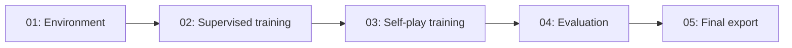

# Running the Chess Notebooks

This guide is for the person running the project, even if they have not programmed before.

## Before You Begin

You need a Google account, enough Drive space for data and saved models, and access to Google Colab. GPU access helps training; an A100 can be selected when your Colab account offers it. This project does not connect to your university HPC automatically.

Put the project in this exact Drive location:

```text
MyDrive
  Colab Notebooks
    Education
      Deep Reinforcement Learning
        Chess
          README.md
          configs
          chess_rl
          notebooks
```

If using the project archive, extract its `Chess` folder into `Deep Reinforcement Learning`. Do not leave the Python helpers inside an unopened ZIP. Google Drive must contain the actual `chess_rl` folder next to `notebooks`.

## Run the Default Experiment

1. In Drive, open `Chess/notebooks/01_chess_environment_and_encoding.ipynb` with Google Colab.
2. Choose **Runtime > Run all**. Grant Drive access when prompted. This permission connects your notebook to your own saved files.
3. Wait for the cells to finish. A number beside a completed cell indicates it ran. A red traceback indicates a failure; read its last line before continuing.
4. When notebook 01 finishes, open notebook 02. Select **Runtime > Change runtime type > GPU**, choosing A100 if available.
5. Run notebook 02. It prepares and labels positions before training. Messages show the actual number prepared, then completed training epochs and checkpoint filenames. This is substantial work; the notebook remains busy while it is working.
6. When notebook 02 finishes, open notebook 03 with a GPU runtime. It plays training games, trains candidates, and runs CPU promotion matches. Read the printed iteration and game counters.
7. When notebook 03 records completion, run notebook 04. A CPU runtime is sufficient. These are real timed games, so leave the notebook running until all selected comparisons finish.
8. Run notebook 05 last, on CPU. It creates and checks the actual submission archive. Use the archive path printed by this notebook, not the project ZIP.

The first cell of every notebook mounts Drive. This is normal. The notebooks do not depend on another tab keeping its variables in memory.

## One Configuration File

The default settings are in `Chess/configs/default.yaml`. Start with them unchanged. When making a new experiment, change `run_id` to a unique name, such as `chess_v2`, before changing its settings.

The two optional search flags are off by default. Turning on model search in notebook 02 runs many training experiments. Turning on search studies in notebook 03 creates separate research branches; those branches do not automatically replace your final champion.

## Order and Parallel Work



| Work | Can it run at the same time? | Condition |
| --- | --- | --- |
| Notebook 01 and default notebook 02 | No | Finish setup and fixtures first. |
| Default notebooks 02 and 03 | No | Self-play needs the selected trained checkpoint. |
| Two independent notebook 02 experiments | Yes | Separate Colab sessions and unique run IDs; do not overwrite a shared config mid-run. |
| Two independent notebook 03 branches | Yes | Each has a fixed starting checkpoint and separate run ID. |
| Notebook 04 and another independent training experiment | Yes | Evaluation reads frozen weights and writes separate outputs. |
| Several timing comparisons sharing one CPU host | Avoid | They compete for CPU and distort measured move times. |
| Notebook 05 and selected training still running | No | Finish the selected work and freeze the model first. |

Opening more tabs does not automatically provide more GPUs. Two tabs connected to the same runtime share its resources. Avoid running two jobs that write the same dataset, checkpoint pointer, match name or Optuna study file.

If a friend runs an independent experiment, give it a unique run ID and an explicit fixed checkpoint path. Do not use a moving 'latest' file from somebody else's active experiment.

## Finding Your Files

| Item | Drive location under Chess |
| --- | --- |
| Prepared data | `datasets/processed/<run_id>/` |
| Supervised models | `checkpoints/supervised/<run_id>/` |
| Best initialization choice | `results/<run_id>/initial_selection.json` |
| Self-play candidates | `checkpoints/self_play/<run_id>/iteration-.../` |
| Current champion | Path recorded in `checkpoints/self_play/<run_id>/league.json` |
| Game replays and logs | `results/<run_id>/matches/` |
| Training graphs | `results/<run_id>/plots/` |
| Final selection | `results/<run_id>/final_selection.json` |
| Final submission | `exports/<model_version>/submission.zip` |
| Final local check report | `results/<run_id>/final_compliance.json` |

Files called 'latest' or 'champion' are references to saved model files; they are not interchangeable measures of quality. The playing champion can remain unchanged after a training iteration.

## After a Disconnect

1. Reopen the notebook for the stage that was running.
2. Choose the appropriate runtime again and run its Drive/setup cells.
3. Keep the same run ID and settings.
4. Run its cells in order. Completed data shards and games are reused; training resumes from complete checkpoints.

A partly completed supervised epoch may repeat. A partly played game is restarted and is not counted as a draw. Do not delete complete checkpoints to 'unstick' training. Ignore incomplete `.tmp` files. If settings changed, use a new run ID instead of forcing an incompatible resume.

## Recognizing Problems

- **Project files missing:** check for an extra nested `Chess` folder and confirm `Chess/chess_rl` exists.
- **CUDA requested but unavailable:** select a GPU runtime, or deliberately set `device: auto` or `cpu`.
- **Stockfish unavailable:** run notebook 02's teacher-install cell and check the configured executable path.
- **No eligible replay:** inspect failed-game logs. Crashes and time losses are retained as failures, not converted into training draws.
- **Run/config mismatch:** a saved run uses different settings. Start a new run ID.
- **Final selection missing:** notebook 04 has not completed the selected workflow yet.
- **Final check failed:** read `final_compliance.json`. This does not automatically restart training.

The project's local checks do not establish acceptance by the competition server. Its validation log is the authority after upload.
